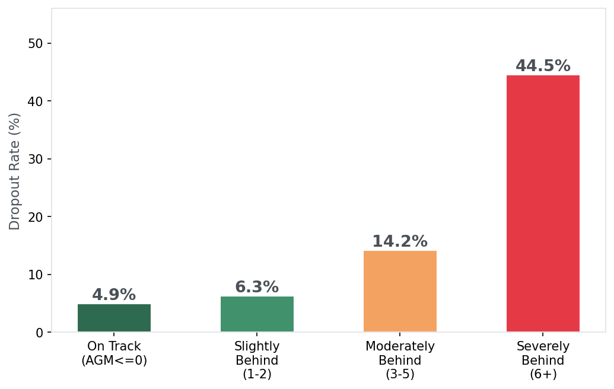
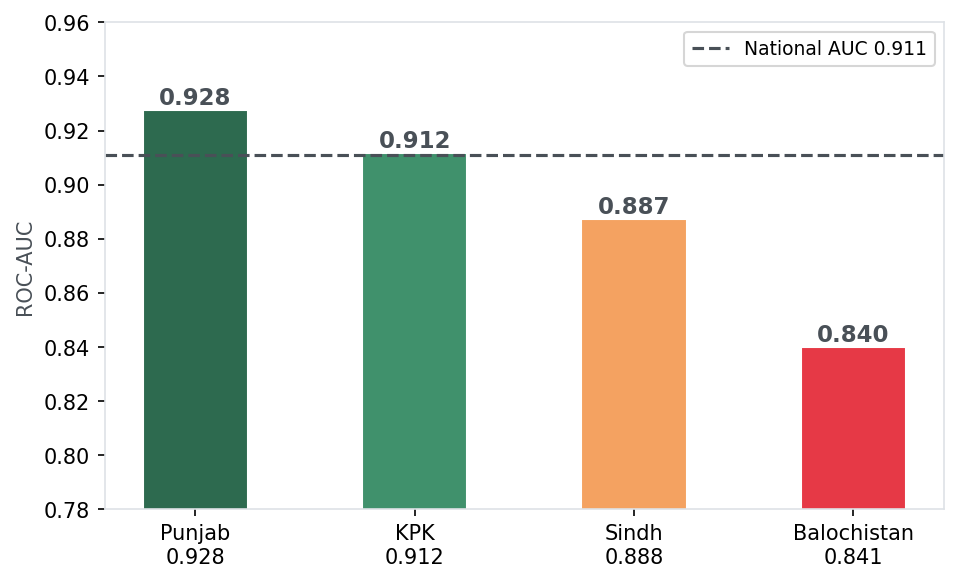

# Predicting School Dropout in Pakistan
### A Hybrid Machine Learning and Explainable AI Framework
#### Replication and Extension of Khatun et al. (2025) using UNICEF MICS Round 6


---

## Overview

Pakistan has the second largest out-of-school child population in the world: 22 million children (UNESCO 2023). The national dropout rate across the four provinces covered in this study stands at **23.6%**, nearly 5 points above Bangladesh's 18.7%. Current government programs like the Benazir Income Support Programme respond after a child has already left school. No system flags at-risk students while they are still enrolled.

This project builds a machine learning model that identifies at-risk students before they drop out, using data the government already collects. The key contribution is the **Age-Grade Mismatch Index (AGM)**, an engineered feature that compresses two raw variables into a single interpretable metric. Students severely behind their expected grade face a **9.1x higher dropout rate** than on-track peers (44.5% vs 4.9%).

XGBoost achieves **0.911 ROC-AUC** and **93.1% recall** across 131,748 school-age children. Province-stratified models reveal a meaningful AUC gap between Punjab (0.928) and Balochistan (0.841) that quantifies unmeasured structural barriers no household survey can capture.

---

## Key Findings

| Finding | Value |
|---|---|
| National dropout rate | 23.6% |
| XGBoost ROC-AUC | 0.911 |
| XGBoost Recall | 93.1% |
| AGM dropout gap (on-track vs severely behind) | 4.9% vs 44.5% (9.1x) |
| Balochistan vs Punjab AUC gap | 0.841 vs 0.928 |
| Students flaggable via EMIS today (AGM >= 2) | ~42% of sample |

<p align="center">
  
  
</p>

---

## Repository Structure

```
pakistan-school-dropout-ml/
├── notebooks/
│   └── MICS_pakistan_school_dropouts_notebook.ipynb   # Full pipeline: preprocessing to SHAP to policy
├── report/
│   └── Report_pakistan_school_dropouts.pdf            # 12-page paper
├── presentation/
│   └── pakistan_school_dropouts.pdf                   # 13-slide deck
├── figures/                                            # Key charts (notebook outputs)
├── data/
│   └── README.md                                       # How to access UNICEF MICS data
├── requirements.txt
└── README.md
```

---

## Methodology

### Data
- **Source:** UNICEF Multiple Indicator Cluster Survey (MICS) Round 6
- **Provinces:** Punjab (2017-18), Sindh (2018-19), KPK (2019), Balochistan (2019-20)
- **Raw records:** 810,026 household members
- **Final sample:** 131,748 school-age children (ages 6-24)
- **Target:** School attendance this year (1 = attending, 0 = dropout)

### Feature Engineering: Age-Grade Mismatch Index

```python
AGM = Age - (Last_education_grade + 6)
```

Pakistan's school entry age is 6. A student in Grade G should be G+6 years old. AGM captures accumulated disadvantage in a single interpretable number. Students with AGM >= 6 face a 44.5% dropout rate.

### Feature Selection (Hybrid Voting)
A feature must pass at least 2 of 3 independent tests:
1. **VIF** (< 5, multicollinearity filter)
2. **Logistic Regression** (p < 0.05 significance)
3. **ML Importance** (top-10 union of RF and XGBoost SHAP)

Final selection: 17 features.

### Models
| Model | Accuracy | Precision | Recall | F1 | ROC-AUC |
|---|---|---|---|---|---|
| Logistic Regression (baseline) | 0.816 | 0.929 | 0.823 | 0.873 | 0.886 |
| Random Forest | 0.817 | 0.885 | 0.875 | 0.880 | 0.853 |
| **XGBoost** | **0.867** | **0.899** | **0.931** | **0.914** | **0.911** |

*10-fold stratified cross-validation. Stratified to preserve the 76/24 class ratio in every fold.*

### Explainability
- **SHAP (global):** Feature importance rankings and beeswarm analysis
- **SHAP (local):** Waterfall plots for two contrasting student profiles
- **LIME:** Independent corroboration of SHAP findings
- **Province-stratified SHAP:** Separate XGBoost per province to identify regional driver differences

---

## Replication: Running the Notebook

The notebook runs on **Google Colab** and downloads data directly from a shared Google Drive folder. No local setup required.

### Step 1: Open in Colab

[](https://colab.research.google.com/github/YOUR_USERNAME/pakistan-school-dropout-ml/blob/main/notebooks/MICS_pakistan_school_dropouts_notebook.ipynb)

### Step 2: Get the Data

See [`data/README.md`](data/README.md) for instructions on accessing the UNICEF MICS Round 6 datasets.

### Step 3: Run Section 0

File IDs are pre-filled in Section 0. Run that cell and the notebook downloads only the two required files (`hl.sav` and `hh.sav`) per province automatically.

### Step 4: Run All

`Runtime > Run all`. The notebook runs top to bottom in approximately 15-20 minutes.

---

## Local Installation (Optional)

```bash
git clone https://github.com/YOUR_USERNAME/pakistan-school-dropout-ml.git
cd pakistan-school-dropout-ml
pip install -r requirements.txt
jupyter notebook notebooks/MICS_pakistan_school_dropouts_notebook.ipynb
```

Local execution requires the MICS `.sav` files placed in the directory structure expected by Section 0.

---

## Policy Implications

Four recommendations, each tied directly to a model output:

1. **NEMIS AGM Flag.** Add Age-Grade Mismatch as a computed field in Pakistan's school database. No new data needed. Auto-flag students with AGM >= 2. Lead: MoFEPT.

2. **BISP Risk-Adjusted Targeting.** Combine poverty eligibility (NSER) with AGM score (NEMIS) via NADRA B-form match. Same budget, better targeting. Lead: BISP Secretariat.

3. **Balochistan Supply-Side Investment.** The model's AUC of 0.841 in Balochistan (vs Punjab's 0.928) quantifies what cash transfers cannot fix. Build schools. Recruit female teachers. Lead: Balochistan ESED + Federal PSDP.

4. **Father Engagement in KPK.** KPK has the largest gender gap (Female 24.2% vs Male 18.4%). Structured father engagement through existing School Management Councils. Hasan (2010) showed 18% enrollment gains using this approach. Lead: KPK ESED.

---

## Limitations

- **44% missingness** in Last_education_grade, imputed by mode. Missingness concentrates in the most disadvantaged households. The model likely understates risk for the hardest-to-reach children.
- **Cross-sectional data.** We identify correlates, not causal mechanisms.
- **Survey weights not applied**, consistent with the benchmark paper (Khatun et al., 2025), for predictive modeling purposes.
- **Province AUC comparison is partially confounded** by sample size differences across provinces (Punjab n=63,727 vs Balochistan n=19,095).

---

## Citation

If you use this work, please cite:

```bibtex
@misc{khan2026dropout,
  title  = {Predicting School Dropout in Pakistan: A Hybrid ML and XAI Framework},
  author = {Khan, Afaq},
  year   = {2026},
  school = {Heinz College, Carnegie Mellon University},
  note   = {Replication of Khatun et al. (2025) using UNICEF MICS Round 6}
}
```

**Reference paper:**
> Khatun, M. R., Mim, M. A., Tasin, M. M., and Hossain, M. M. (2025). A hybrid framework of statistical, machine learning, and explainable AI methods for school dropout prediction. *PLOS One*, 20(9), e0331917.

---

## Author

**Afaq Khan** — MSPPM-DA, Heinz College, Carnegie Mellon University

*Machine Learning for Public Policy — Spring 2026*

---

## License

This project is licensed under the MIT License. See [`LICENSE`](LICENSE) for details.

The UNICEF MICS data used in this analysis is subject to UNICEF's data access terms. It is not redistributed here. Access instructions are in [`data/README.md`](data/README.md).
